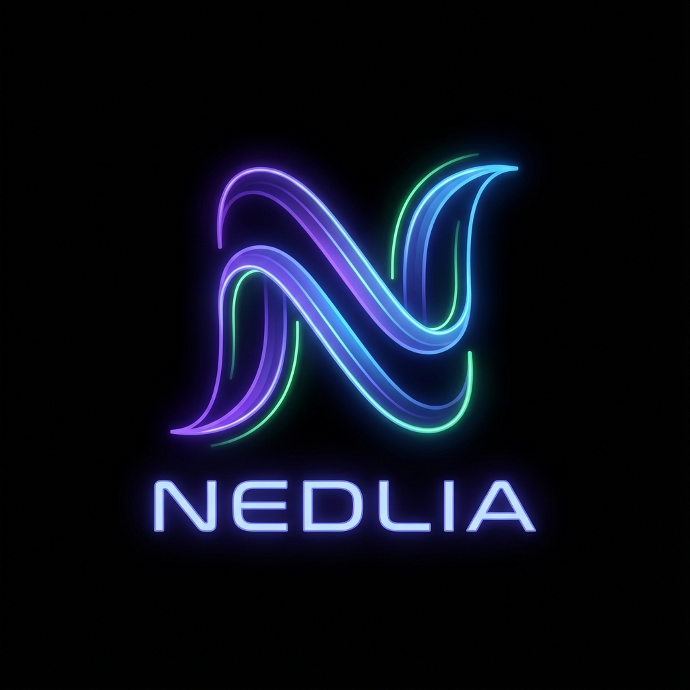

<p align="center">
  
</p>

<p align="center">
    <em>Product placement validation platform for video content.</em>
</p>

<p align="center">
  <a href="LICENSE"></a>
  <a href="CONTRIBUTING.md"></a>
  <a href="https://github.com/onelasha/Nedlia"></a>
</p>

---

> 🚧 **Alpha** – Under active development

## 👋 New to the project?

**Start with [ONBOARDING.md](ONBOARDING.md)** — a single-page walkthrough that takes you from cloning the repo to opening your first PR. Everything else on this page is reference material.

---

## Table of Contents

- [What is Nedlia?](#-what-is-nedlia)
- [Quick Start](#-quick-start)
- [Repository Structure](#-repository-structure)
- [Projects](#-projects)
- [Tech Stack](#-tech-stack)
- [Documentation](#-documentation) — indexed by role
- [Environments](#-environment-strategy)
- [Contributing](#-contributing)

---

## 🎯 What is Nedlia?

Nedlia is an end-to-end platform that helps **brands** and **content creators** manage, validate, and track product placements in video content. Whether you're a filmmaker integrating sponsored products or a brand ensuring placements meet contractual requirements, Nedlia streamlines the entire workflow.

### The Problem

Product placement in video content is a **$23B+ industry**, yet the process remains fragmented and manual:

- **Brands** struggle to verify that placements meet visibility, duration, and context requirements
- **Creators** lack tools to manage multiple placement contracts efficiently
- **Agencies** have no standardized way to report placement performance

### The Solution

Nedlia provides:

- **🎬 Video Editor Plugins** – Mark placements directly in Final Cut Pro, DaVinci Resolve, and LumaFusion
- **✅ Automated Validation** – AI-powered verification that placements meet contractual specs
- **📊 Analytics Dashboard** – Real-time tracking of placement performance across content
- **🔗 SDK Integration** – Embed placement tracking in video players for live viewership data
- **📋 Contract Management** – Centralized hub for placement agreements and compliance
- **🏗️ Infrastructure as Code** – Automated cloud provisioning using Terraform and Terragrunt

### Who It's For

| User                     | Use Case                                                        |
| ------------------------ | --------------------------------------------------------------- |
| **Content Creators**     | Tag placements in editing software, generate compliance reports |
| **Brands & Advertisers** | Validate placements, track ROI, manage campaigns                |
| **Agencies**             | Oversee multiple creator relationships, aggregate reporting     |
| **Streaming Platforms**  | Integrate SDK for viewer engagement metrics                     |

---

## 🚀 Quick Start

> First time? Use [ONBOARDING.md](ONBOARDING.md) instead — it walks you through prerequisites and setup.

```bash
git clone https://github.com/onelasha/Nedlia.git
cd Nedlia
pnpm install
pnpm verify-hooks       # ✅ must show: Git hooks installed
```

Run a project:

```bash
nx run portal:serve              # Frontend    → http://localhost:5173
nx run api:serve                 # Backend API → http://localhost:8000
nx run placement-service:serve   # Service     → http://localhost:8001
```

### Common Commands

| Command                  | Description                    |
| ------------------------ | ------------------------------ |
| `nx run <project>:serve` | Start a project                |
| `nx run-many -t lint`    | Lint all projects              |
| `nx run-many -t test`    | Test all projects              |
| `nx run-many -t build`   | Build all projects             |
| `nx affected -t lint`    | Lint changed projects only     |
| `nx graph`               | Visualize project dependencies |

---

## 📁 Repository Structure

```
nedlia/
├── tools/                    # Shared tooling configs (eslint, ruff, gitleaks)
├── nedlia-back-end/          # FastAPI api, workers, Fargate services, shared domain
├── nedlia-front-end/         # React portal (Vite, Tailwind)
├── nedlia-sdk/               # Client SDKs: js, python, swift
├── nedlia-plugin/            # Video editor plugins: finalcut, davinci, lumafusion
├── nedlia-IaC/               # Terraform + Terragrunt
├── docs/                     # Architecture, style guides, runbooks (see below)
└── releases/                 # Release manifests
```

Each top-level directory has its own `README.md` describing what's inside.

---

## 📦 Projects

| Project               | Type    | Language   | Description                       |
| --------------------- | ------- | ---------- | --------------------------------- |
| **portal**            | App     | TypeScript | React web portal for advertisers  |
| **api**               | App     | Python     | FastAPI REST API                  |
| **placement-service** | App     | Python     | Placement management microservice |
| **workers**           | App     | Python     | Event-driven background workers   |
| **sdk-js**            | Library | TypeScript | Video player SDK                  |

---

## 🔧 Tech Stack

| Layer              | Technologies                                              |
| ------------------ | --------------------------------------------------------- |
| **Frontend**       | React, TypeScript, Vite, TailwindCSS                      |
| **Backend**        | FastAPI (Python), PostgreSQL                              |
| **Infrastructure** | AWS (Lambda, API Gateway, S3, SQS), Terraform, Terragrunt |
| **Plugins**        | Swift, SwiftUI (macOS/iOS)                                |
| **Monorepo**       | Nx, pnpm workspaces                                       |
| **Quality**        | ESLint, Ruff, Prettier, Husky                             |

---

## 📚 Documentation

Docs are organized by **what you're trying to do**. Pick the row that matches.

### 🆕 I'm new here

| Doc                                                                | What's in it                                                   |
| ------------------------------------------------------------------ | -------------------------------------------------------------- |
| [ONBOARDING.md](ONBOARDING.md)                                     | **Start here.** Day-1 walkthrough: clone → install → first PR. |
| [docs/getting-started.md](docs/getting-started.md)                 | Detailed prerequisite install (Node, pnpm, Python, uv).        |
| [docs/local-development.md](docs/local-development.md)             | Run services locally (db, api, workers, portal).               |
| [CONTRIBUTING.md](CONTRIBUTING.md)                                 | How to contribute, commit conventions.                         |
| [docs/branching-strategy.md](docs/branching-strategy.md)           | Trunk-based development.                                       |
| [docs/pull-request-guidelines.md](docs/pull-request-guidelines.md) | What a good PR looks like.                                     |

### 🏛️ I want to understand the architecture

| Doc                                                            | What's in it                                                         |
| -------------------------------------------------------------- | -------------------------------------------------------------------- |
| [ARCHITECTURE.md](ARCHITECTURE.md)                             | Layer model, dependency rules, AWS event-driven design.              |
| [docs/domain-model.md](docs/domain-model.md)                   | Placement, Video, Campaign, Product entities.                        |
| [docs/data-architecture.md](docs/data-architecture.md)         | Storage strategy, schemas, data flow.                                |
| [docs/security-architecture.md](docs/security-architecture.md) | Auth, secrets, threat model.                                         |
| [docs/adr/](docs/adr/)                                         | Architecture Decision Records (clean arch, AWS, event-driven, etc.). |

### 🐍 Backend (Python: api, workers, services)

| Doc                                                                | What's in it                                     |
| ------------------------------------------------------------------ | ------------------------------------------------ |
| [nedlia-back-end/README.md](nedlia-back-end/README.md)             | Backend overview, lambda vs fargate.             |
| [docs/python-style-guide.md](docs/python-style-guide.md)           | Python conventions, type hints, project layout.  |
| [docs/api-standards.md](docs/api-standards.md)                     | REST conventions, status codes, response shapes. |
| [docs/error-handling.md](docs/error-handling.md)                   | RFC 9457 problem details — core guide.           |
| [docs/error-handling-strategy.md](docs/error-handling-strategy.md) | Per-project-type error handling.                 |
| [docs/database-migrations.md](docs/database-migrations.md)         | How migrations work.                             |
| [docs/idempotency.md](docs/idempotency.md)                         | Idempotency keys for handlers.                   |
| [docs/event-schema-versioning.md](docs/event-schema-versioning.md) | Versioning EventBridge events.                   |

### ⚛️ Frontend (React portal)

| Doc                                                                    | What's in it                           |
| ---------------------------------------------------------------------- | -------------------------------------- |
| [nedlia-front-end/portal/README.md](nedlia-front-end/portal/README.md) | Portal setup and tech stack.           |
| [docs/frontend-architecture.md](docs/frontend-architecture.md)         | Layer structure, state, data fetching. |
| [docs/typescript-style-guide.md](docs/typescript-style-guide.md)       | TypeScript conventions.                |
| [docs/accessibility.md](docs/accessibility.md)                         | A11y standards (WCAG).                 |
| [docs/internationalization.md](docs/internationalization.md)           | i18n approach.                         |

### ✅ Code quality, testing, principles

| Doc                                                          | What's in it                            |
| ------------------------------------------------------------ | --------------------------------------- |
| [docs/code-quality.md](docs/code-quality.md)                 | SonarCloud, linters, formatters, hooks. |
| [docs/SOLID-PRINCIPLES.md](docs/SOLID-PRINCIPLES.md)         | ESLint rules mapped to SOLID.           |
| [docs/dry-principles.md](docs/dry-principles.md)             | DRY philosophy and pitfalls.            |
| [docs/dependency-injection.md](docs/dependency-injection.md) | DI patterns across stacks.              |
| [docs/testing-strategy.md](docs/testing-strategy.md)         | Test pyramid, fixtures, integration.    |

### ⚙️ Operations & infrastructure

| Doc                                                                            | What's in it                                   |
| ------------------------------------------------------------------------------ | ---------------------------------------------- |
| [docs/deployment.md](docs/deployment.md)                                       | CI/CD pipeline, environments, deployment flow. |
| [docs/deployment-orchestration.md](docs/deployment-orchestration.md)           | Multi-team monorepo deployment strategy.       |
| [docs/release-management.md](docs/release-management.md)                       | Tagging, release notes, hotfixes.              |
| [docs/versioning-strategy.md](docs/versioning-strategy.md)                     | SemVer across packages and SDKs.               |
| [docs/observability.md](docs/observability.md)                                 | Metrics, logs, traces — what to instrument.    |
| [docs/distributed-tracing.md](docs/distributed-tracing.md)                     | X-Ray and OpenTelemetry.                       |
| [docs/logging-standards.md](docs/logging-standards.md)                         | Structured logging conventions.                |
| [docs/incident-response.md](docs/incident-response.md)                         | On-call runbook.                               |
| [nedlia-IaC/README.md](nedlia-IaC/README.md)                                   | Terraform/Terragrunt usage.                    |
| [nedlia-IaC/docs/NAMING_CONVENTIONS.md](nedlia-IaC/docs/NAMING_CONVENTIONS.md) | IaC resource naming.                           |
| [nedlia-IaC/docs/ORGANIZATION.md](nedlia-IaC/docs/ORGANIZATION.md)             | IaC module organization.                       |

### 🛡️ Resilience & performance

| Doc                                                              | What's in it                         |
| ---------------------------------------------------------------- | ------------------------------------ |
| [docs/resilience-patterns.md](docs/resilience-patterns.md)       | Retries, circuit breakers, timeouts. |
| [docs/rate-limiting.md](docs/rate-limiting.md)                   | API rate limits.                     |
| [docs/caching-strategy.md](docs/caching-strategy.md)             | When and where to cache.             |
| [docs/performance-guidelines.md](docs/performance-guidelines.md) | Frontend and backend perf targets.   |
| [docs/feature-flags.md](docs/feature-flags.md)                   | Feature flag conventions.            |
| [docs/data-retention.md](docs/data-retention.md)                 | Retention policies.                  |

### 📋 Project meta

| Doc                                      | What's in it                  |
| ---------------------------------------- | ----------------------------- |
| [CHANGELOG.md](CHANGELOG.md)             | What changed in each release. |
| [SECURITY.md](SECURITY.md)               | Reporting vulnerabilities.    |
| [CODE_OF_CONDUCT.md](CODE_OF_CONDUCT.md) | Community guidelines.         |
| [LICENSE](LICENSE)                       | MIT.                          |

---

## 📈 Environment Strategy

| Env    | Purpose           | Characteristics                                         |
| :----- | :---------------- | :------------------------------------------------------ |
| `dev`  | Development       | Features-in-progress, frequent updates, reduced scale.  |
| `qa`   | Quality Assurance | Integration testing, bug bashing, user acceptance.      |
| `stg`  | Staging           | Pre-production parity, final validation of deployments. |
| `prod` | Production        | Live production traffic, high availability, security.   |

---

## 🤝 Contributing

See [CONTRIBUTING.md](CONTRIBUTING.md) and [ONBOARDING.md](ONBOARDING.md). All commits are validated with **Shift-Left Parity** — the pre-commit hook runs the same checks as CI, so a green commit means a green build.

## 📄 License

[MIT License](LICENSE)
